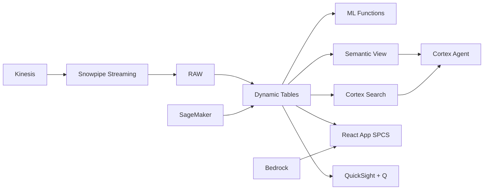

# Marketplace Seller Intelligence & Risk Scoring

Philippine e-commerce grew 25% to $18B — Snowflake builds real-time seller health scores with Dynamic Tables, classifies risk with ML, detects anomalous behavior, and protects marketplace integrity at scale.

## Architecture

Philippine e-commerce hit $18 billion in 2023, growing 25% annually. But rapid growth brings risk: counterfeit products, fake reviews, and policy-violating sellers erode buyer trust. A leading Philippine marketplace with 42,000 sellers needs real-time seller intelligence — not weekly spreadsheet reports that catch problems after buyers have already been burned.



## Snowflake Capabilities

| Capability | Implementation |
|-----------|---------------|
| Dynamic Tables | SELLER_HEALTH_SCORE / CATEGORY_RISK_PROFILE / SELLER_TIMESERIES / MARKETPLACE_GMV |
| ML Functions | ML.CLASSIFICATION + ML.ANOMALY_DETECTION |
| Cortex AI | AI_CLASSIFY, AI_SENTIMENT, COMPLETE |
| Cortex Search | 1800000 documents indexed |
| Cortex Agent | MARKETPLACE_INTELLIGENCE_AGENT |
| Semantic View | MARKETPLACE_ANALYTICS |
| React App (SPCS) | 5 tabs + DemoGuide |


## AWS Services

| Service | Role in Demo |
|---------|-------------|
| Amazon Kinesis | Stream real-time seller performance metrics |
| Amazon SageMaker | Seller risk classification model |
| Amazon Comprehend | Review sentiment analysis and fake detection |
| Amazon Bedrock (Claude) | Generate seller performance narratives |
| Amazon QuickSight + Q | Marketplace operations dashboard |
| Amazon Personalize | Seller recommendation for buyers |


## Personas

| Persona | Role | Key Questions |
|---------|------|---------------|
| **Bianca Gabrielle Co** | VP Marketplace Operations | "Which seller categories have the highest risk scores?" "What's our GMV growth this month?" |
| **Miguel Eduardo Razon** | Seller Analytics Lead | "Which new sellers are showing early warning signals?" "Show me the return rate trend for electronics category." |


## Data

| Table | Rows | Description |
|-------|------|-------------|
| SELLERS | 42,000 | Active marketplace sellers with onboarding data |
| LISTINGS | 2,800,000 | Product listings across all categories |
| ORDERS | 4,500,000 | 60 days of order transactions |
| REVIEWS | 1,800,000 | Buyer reviews and ratings |
| RETURNS | 340,000 | Return and refund records with reasons |
| SELLER_METRICS | 850,000 | Daily seller performance metrics from Kinesis |


## Build Instructions

### Prerequisites
- Snowflake account with ACCOUNTADMIN access
- Cortex AI enabled (ML Functions, Search, Agent)
- Warehouse: MKTPLACE_WH (Medium)
- AWS CLI with access (us-west-2)

### Deployment

```bash
snowsql -f snowflake/00_setup.sql
snowsql -f snowflake/01_marketplace_install.sql
snowsql -f snowflake/02_raw_tables.sql
snowsql -f snowflake/03_staging.sql
snowsql -f snowflake/04_dynamic_tables.sql
snowsql -f snowflake/05_search.sql
snowsql -f snowflake/06_ml_models.sql
snowsql -f snowflake/07_semantic_view.sql
snowsql -f snowflake/08_agent.sql
```

### React App (SPCS)
```bash
cd app && npm ci && npm run build
docker build -t aws-philippines-retail-marketplace-app .
docker push bdiqc8sm-default.registry.snowflakecomputing.com/marketplace_intel/app/aws_philippines_retail_marketplace/app:latest
```

### Demo Mode
Open the app URL with `?demo=true` for presenter view.

## Build Modes

### Snowflake Only
Run scripts 00-08 (skip AWS-specific integration). Uses:
- **Snowpipe Streaming SDK** instead of Amazon Kinesis
- **ML.CLASSIFICATION (native)** instead of Amazon SageMaker
- **AI_SENTIMENT + AI_CLASSIFY (native)** instead of Amazon Comprehend
- **Cortex Complete** instead of Amazon Bedrock (Claude)
- **Snowflake Intelligence (Cortex Analyst)** instead of Amazon QuickSight + Q
- **ML.CLASSIFICATION + Dynamic Tables** instead of Amazon Personalize

### Full AWS + Snowflake
Run all scripts including AWS integration. Deploy QuickSight dashboard from `quicksight/`.

## Business Impact

Industry research and Snowflake customer outcomes:
- **Philippine e-commerce market reached $18B in 2023 with 25% YoY growth** — [Google-Temasek SEA Report](https://www.bain.com/insights/e-conomy-sea-2023/)
- **Marketplace fraud costs sellers and platforms $48B globally in 2023** — [Juniper Research](https://www.juniperresearch.com/researchstore/fintech-payments/online-payment-fraud)
- **AI-powered seller monitoring improves buyer satisfaction 20-30%** — [McKinsey Retail](https://www.mckinsey.com/industries/retail/our-insights)
- **Real-time risk scoring reduces counterfeit listings by 40-60%** — [Forrester](https://www.forrester.com/research/digital-commerce/)


## Key Demo Numbers

- **₱18.7B** monthly GMV across 42,000 sellers
- **1,240 sellers** classified as HIGH risk
- **67 sellers** flagged for anomalous behavior this week
- **14.8%** electronics return rate (2x platform average)
- **1.8M reviews** analyzed by AI_SENTIMENT + AI_CLASSIFY
- **25% YoY** GMV growth rate


## License

Apache 2.0 — See [LICENSE](LICENSE) for details.

This is a personal demo project and is not an official Snowflake offering. It comes with no support or warranty.